# **Consultas SELECT**

  
<b>Base de datos implementada</b>

<pre>
-- Crear la base de datos llamada companeritos
CREATE DATABASE companeritos;

-- Indicar la base que vamos a modificar
USE companeritos;

-- Crear tabla "Animales"
CREATE TABLE Animales (
  id_animal INT PRIMARY KEY,
  nombre VARCHAR(50),
  especie VARCHAR(50),
  edad INT,
  peso FLOAT
);

-- Crear tabla "Propietarios"
CREATE TABLE Propietarios (
  id_propietario INT PRIMARY KEY,
  nombre VARCHAR(50),
  direccion VARCHAR(100),
  telefono VARCHAR(20)
);

-- Crear tabla "Animales_Propietarios" (tabla de relación)
CREATE TABLE Animales_Propietarios (
  id_animal INT,
  id_propietario INT,
  fecha_adopcion DATE,
  FOREIGN KEY (id_animal) REFERENCES Animales(id_animal),
  FOREIGN KEY (id_propietario) REFERENCES Propietarios(id_propietario)
);

-- Insertar datos en la tabla "Animales"
INSERT INTO Animales (id_animal, nombre, especie, edad, peso)
VALUES
  (1, 'Max', 'Perro', 3, 12.5),
  (2, 'Luna', 'Gato', 2, 5.7),
  (3, 'Bobby', 'Perro', 5, 8.2),
  (4, 'Whiskers', 'Gato', 1, 4.3),
  (5, 'Rocky', 'Perro', 4, 18.9),
  (6, 'Coco', 'Loro', 8, 0.6),
  (7, 'Simba', 'León', 6, 150.2),
  (8, 'Nemo', 'Pez', 1, 0.1),
  (9, 'Molly', 'Gato', 7, 6.4),
  (10, 'Charlie', 'Perro', 2, 9.1);

-- Insertar datos en la tabla "Propietarios"
INSERT INTO Propietarios (id_propietario, nombre, direccion, telefono)
VALUES
  (1, 'Juan Perez', 'Calle Principal 123', '123-456-7890'),
  (2, 'María López', 'Avenida Central 456', '987-654-3210'),
  (3, 'Pedro González', 'Carrera 7 890', '567-890-1234'),
  (4, 'Ana Rodríguez', 'Calle Secundaria 456', '432-109-8765'),
  (5, 'Carlos Fernández', 'Avenida Norte 789', '321-654-0987'),
  (6, 'Laura Gómez', 'Carrera 5 432', '876-543-2109'),
  (7, 'Luis Torres', 'Calle Sur 987', '210-987-5432'),
  (8, 'Gabriela Sánchez', 'Avenida Oeste 654', '567-321-0987'),
  (9, 'Andrés Romero', 'Carrera 10 321', '890-098-7654'),
  (10, 'Isabel Martínez', 'Calle Este 678', '123-890-4567');

-- Insertar datos en la tabla "Animales_Propietarios"
INSERT INTO Animales_Propietarios (id_animal, id_propietario, fecha_adopcion)
VALUES
  (1, 2, '2022-03-15'),
  (2, 5, '2021-09-08'),
  (3, 1, '2023-01-22'),
  (4, 4, '2022-07-11'),
  (5, 3, '2023-04-05'),
  (6, 6, '2021-12-18'),
  (7, 7, '2022-08-27'),
  (8, 10, '2023-02-14'),
  (9, 9, '2022-05-03'),
  (10, 8, '2022-10-19');
</pre>

 

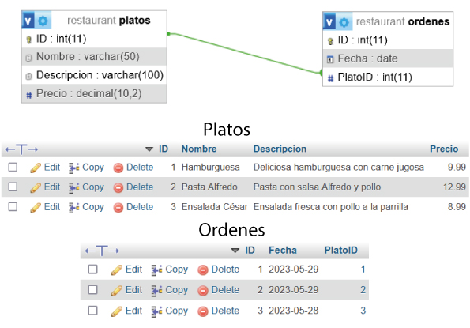

 
 

## **Consultando una única tabla**
---

🆕 ***Trae todas las filas de todas las columnas de la tabla "Animales"***

<pre>
SELECT * 
FROM Animales ;
</pre>

  
Resultado

  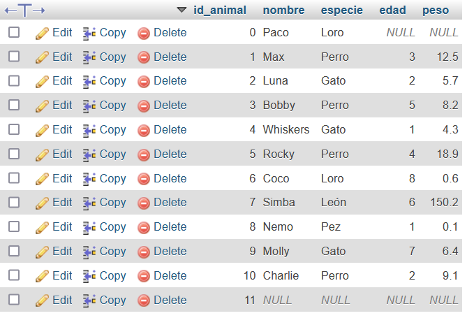

 

🆕 ***Trae todas las filas donde las columnas tienen por encabezado "nombre" y "especie" de la tabla "Animales"***

<pre>
SELECT nombre, especie 
FROM Animales ;
</pre>

  
Resultado

  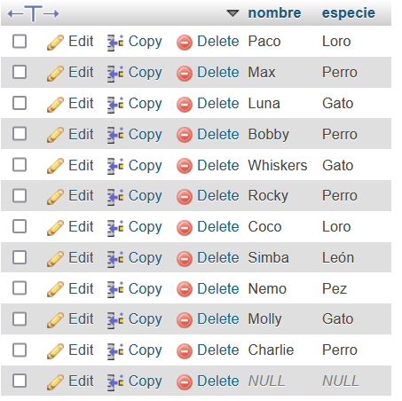

 

🆕 ***Trae todas las filas donde los encabezados de las columnas sean "edad" y "nombre" de la tabla "Animales" y las organiza por edades de manera ascendente***

<pre>
SELECT edad, nombre 
FROM animales 
ORDER BY edad ASC; 
</pre>

  
Resultado

  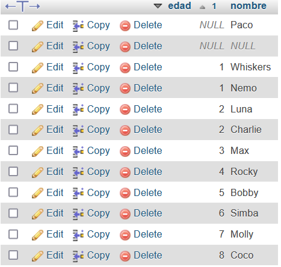

 

🆕 ***Trae todas las filas donde los encabezados de las columnas sean "edad" y "nombre" de la tabla "Animales" y las organiza por edades de manera descendente***

<pre>
SELECT edad, nombre 
FROM animales 
ORDER BY edad DESC; 
</pre>

  
Resultado

  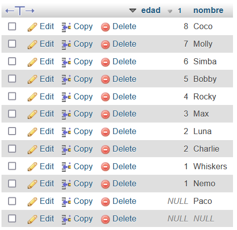

 
 
 

### **Colocando "Alias"**
---

🆕 ***Colocar alias a una columna***

<pre>
SELECT nombre AS dueño
FROM Propietarios ;
</pre>

  
Resultado

  

 

🆕 ***Colocar alias a una tabla***

<pre>
SELECT *
FROM Animales AS Mascota ;
</pre>

 
 
 

### **Filtrando la salida**
---

🆕 ***Trae todas las filas de la tabla "Animales" donde el precio sea menor a 10***

<pre>
SELECT * 
FROM animales 
WHERE peso < 10 ;
</pre>

  
Resultado

  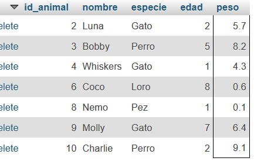

 

🆕 ***Trae todas las filas de la tabla "Animales" donde la especie NO contenga Gato ni Perro***

<pre>
SELECT * 
FROM animales 
WHERE especie != "Gato" AND especie != "Perro" ;
</pre>

  
Resultado

  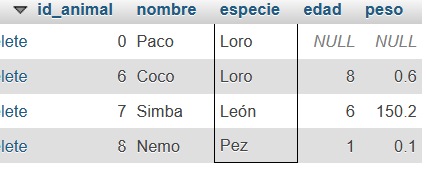

 

🆕 ***Trae todas las filas de la tabla "Animales" donde el nombre comience en C***

<pre>
SELECT * 
FROM animales 
WHERE nombre LIKE "c%" ;
</pre>

  
Resultado

  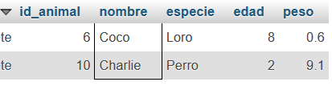

 

🆕 ***Trae todas las filas de la tabla "Animales" donde el nombre finalice en O***

<pre>
SELECT * 
FROM animales 
WHERE nombre LIKE "%o" ;
</pre>

  
Resultado

  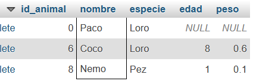

 

🆕 ***Trae todas las filas de la tabla "animales_propietarios" donde la fecha de adopción este entre las fechas especificas.***

<pre>
SELECT * 
FROM animales_propietarios 
WHERE fecha_adopcion BETWEEN "2021-10-10" AND "2022-10-10" ;
</pre>

  
Resultado

  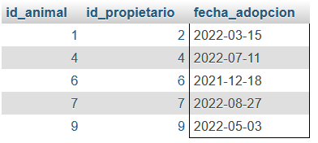

 

🆕 ***Trae todas las filas de la tabla "Animales" donde el valor de la especie NO sea nulo***

<pre>
SELECT * 
FROM animales 
WHERE especie IS NOT NULL ;
</pre>

  
Resultado

  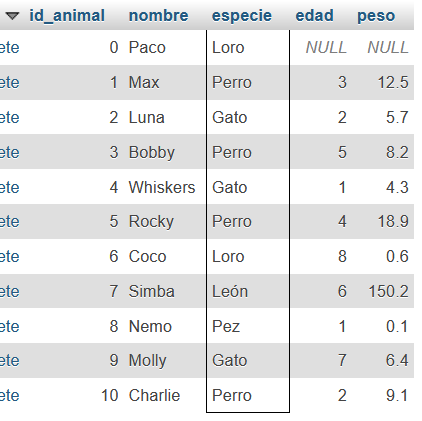

 

🆕 ***Trae todas las filas de la tabla "Animales" donde el el id_animal sea 1, 5, 9, 12***

<pre>
SELECT * 
FROM animales 
WHERE id_animal IN (1,5, 9, 12) ;
</pre>

  
Resultado

  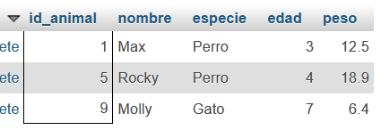

 
 
 

## **Consultando varias tablas**
---

### *JOIN o INNER JOIN*

###### Esta es la forma más común de realizar una unión y se utiliza para combinar registros relacionados en ambas tablas.

🆕 ***Trae las filas "nombre" y "especie" de la tabla "Animales" y las filas "nombre" y "telefono" de la tabla "propietarios" relacionados por la llave foranea en este caso el "id"***

<pre>
SELECT animales.nombre, animales.especie, propietarios.nombre, propietarios.telefono 
FROM animales 
INNER JOIN propietarios 
ON animales.id_animal = propietarios.id_propietario; 
</pre>

  
Resultado

  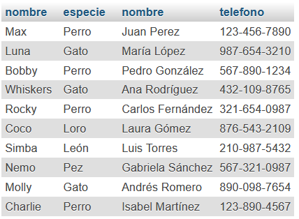

 

### *LEFT JOIN*

###### Devuelve todos los registros de la tabla de la izquierda y los registros coincidentes de la tabla de la derecha.

🆕 ***Trae todas las filas relacionados por la llave foranea en este caso el "id". Si no hay coincidencias de la tabla "propietarios", aparecera con valor NULL***

<pre>
SELECT * 
FROM animales 
LEFT JOIN propietarios ON animales.id_animal = propietarios.id_propietario ;
</pre>

  
Resultado

  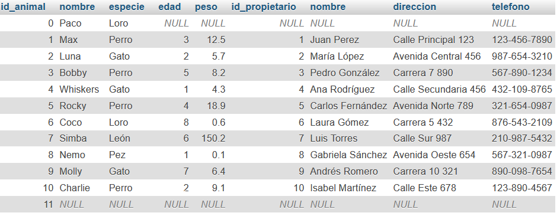

 

### *RIGTH JOIN*

###### Devuelve todos los registros de la tabla de la derecha y los registros coincidentes de la tabla de la izquierda.

🆕 ***Trae todas las filas relacionados por la llave foranea en este caso el "id". Si no hay coincidencias de la tabla "animales", aparecera con valor NULL***

<pre>
SELECT * 
FROM animales 
RIGHT JOIN propietarios ON animales.id_animal = propietarios.id_propietario ; 
</pre>

  
Resultado

  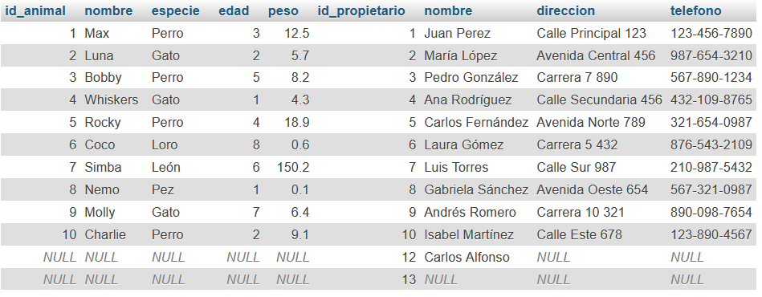

 

### *FULL JOIN o FULL OUTER JOIN*

###### Es útil cuando se desea combinar todas las filas de ambas tablas y analizar las diferencias entre ellas.

🆕 ***Trae todas las filas relacionadas y no relacionas por la llave foranea, donde no se relacione por defecto aparecerá NULL***

<pre>
SELECT * 
FROM animales 
FULL JOIN propietarios ON id_animal = propietarios.id_propietario; 
</pre>

  
Resultado

  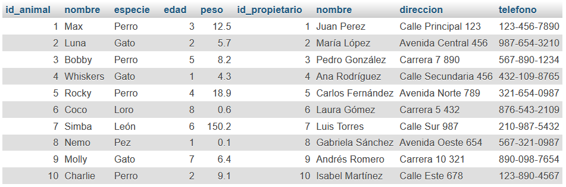

 
 
 

## **Agregación y agrupación**
---

🆕 ***GROUP BY permite agrupar filas en función de los valores de una o varias columnas y aplicar funciones de agregación a cada grupo. Esto es útil para obtener información resumida y realizar cálculos sobre conjuntos de datos agrupados de manera lógica.***

<pre>
SUM()
COUNT()
AVG()
MAX()
MIN()
</pre>

🆕 ***Devuelve el conteo de todos los registros de la tabla "Animales"***

<pre>
SELECT COUNT(*) 
FROM animales ;
</pre>

  
Resultado

  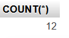

 

🆕 ***Devuelve el conteo de registros en la columna "edad" sin valores nulos de la tabla "Animales"***

<pre>
SELECT COUNT(edad) AS numero_edades
FROM animales ;
</pre>

  
Resultado

  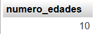

 

🆕 ***Devuelve el conteo de registros en la columna "especie" que son distintivos de la tabla "Animales"***

<pre>
SELECT COUNT(DISTINCT especie) AS especies
FROM animales ; 
</pre>

  
Resultado

  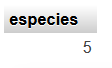

 

🆕 ***Devuelve el valor minimo y maximo en la columna "peso" de la tabla "Animales"***

<pre>
SELECT MIN(peso) AS peso_min, MAX(peso) AS peso_max 
FROM animales; 
</pre>

  
Resultado

  

 

🆕 ***Devuelve la suma total de las edades de la tabla "Animales"***

<pre>
SELECT SUM(edad) 
FROM animales; 
</pre>

  
Resultado

  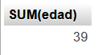

 

🆕 ***Devuelve el promedio de las edades de la tabla "Animales"***

<pre>
SELECT AVG(edad) AS promedio_edades
FROM animales; 
</pre>

  
Resultado

  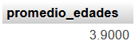

 

## **Sub-consultas**
---