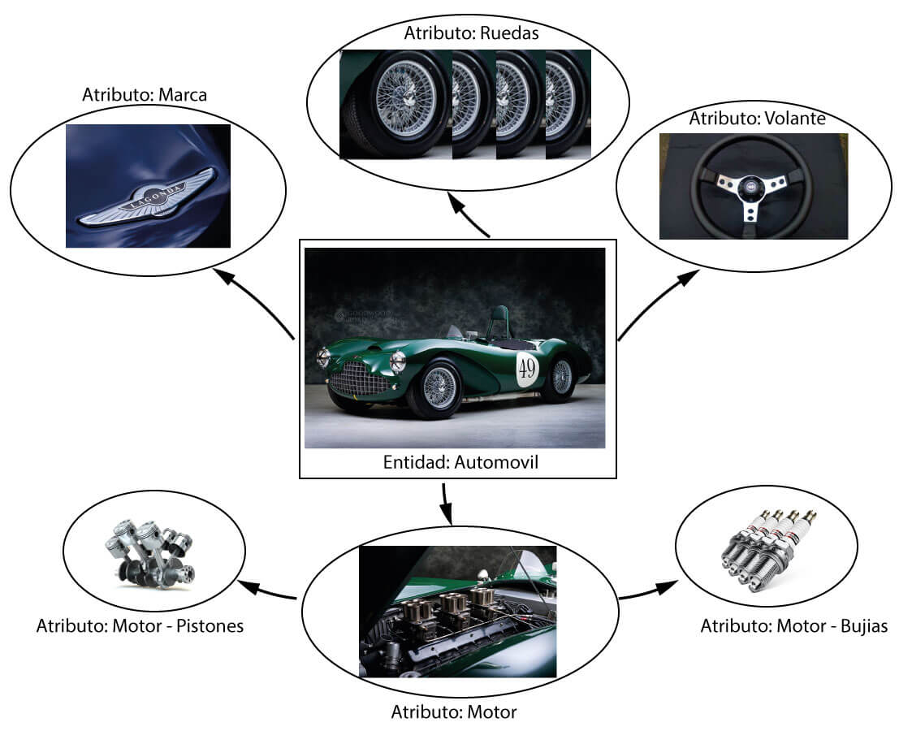
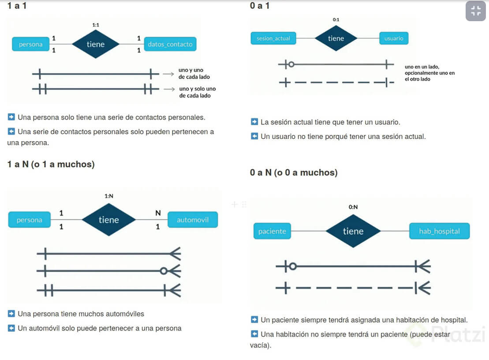
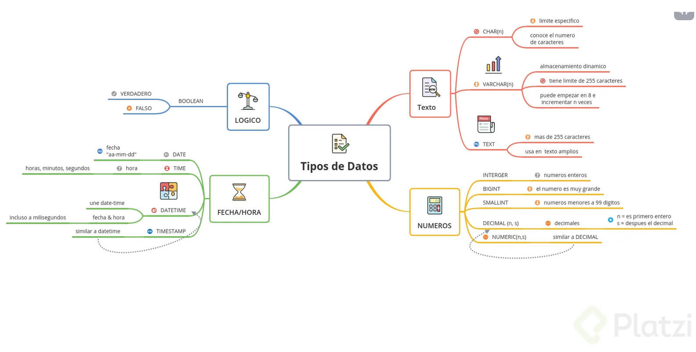
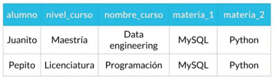
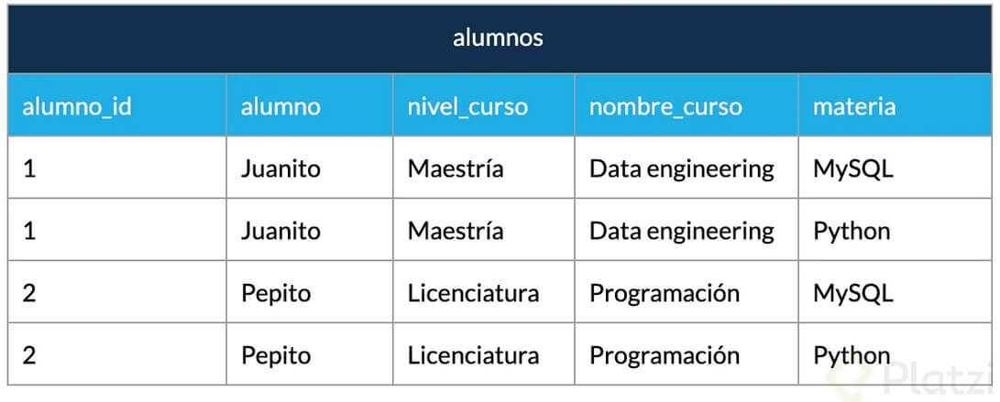
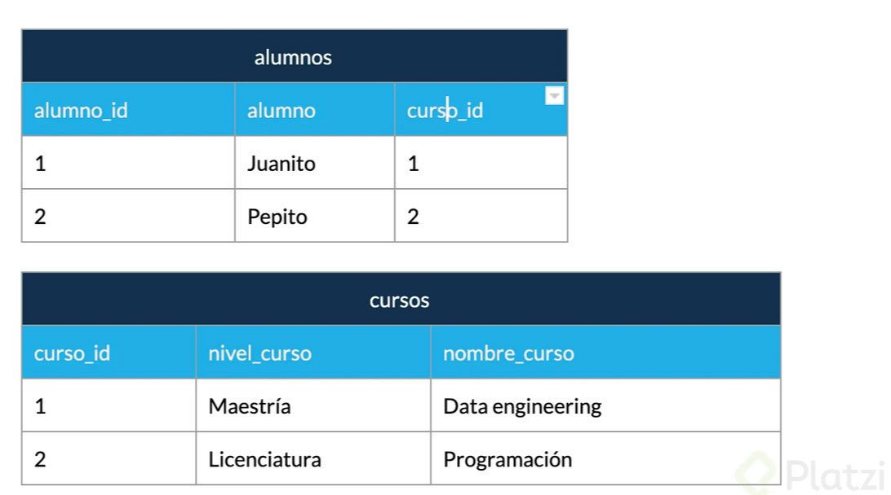
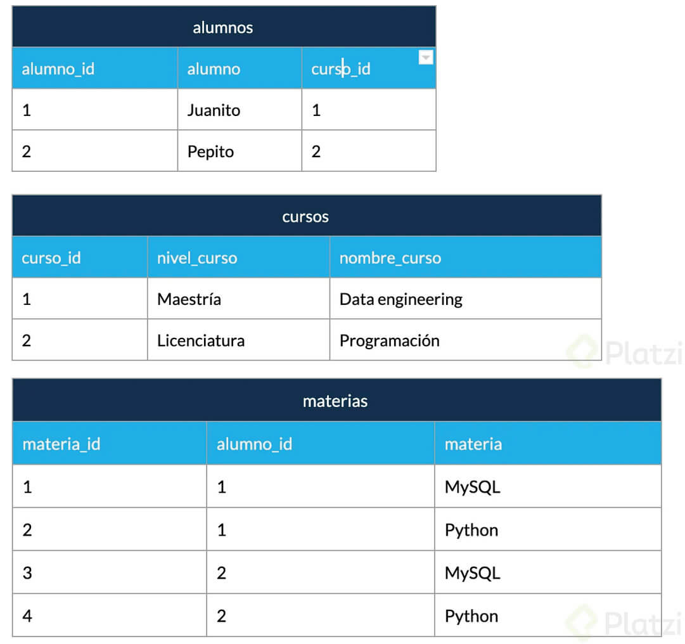
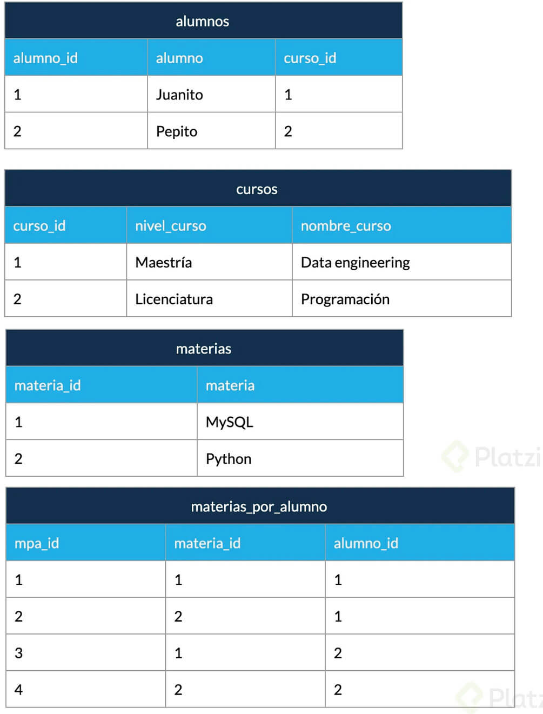

# **Fundamentos de bases de datos**

### **Historia de las bases de datos relacionales**

En la década de 1970, Edgar F. Codd propuso un nuevo enfoque para el manejo de datos llamado modelo relacional. En lugar de almacenar los datos en estructuras rígidas, como los sistemas de archivos tradicionales, propuso organizarlos en tablas bidimensionales llamadas relaciones. 

Estas relaciones podían establecerse entre diferentes tablas mediante claves primarias y externas (Foráneas), permitiendo la vinculación y consulta eficiente de datos relacionados. Esto llevó al desarrollo de sistemas de gestión de bases de datos relacionales, como Oracle y MySQL, que se convirtieron en la piedra angular de muchas aplicaciones empresariales. 

Aunque han surgido otras formas de bases de datos, las bases de datos relacionales siguen siendo ampliamente utilizadas debido a su capacidad para manejar transacciones y mantener la integridad de los datos, así como para realizar consultas y análisis complejos.

[Las 12 reglas de Codd](https://www.mindmeister.com/es/1079684487/las-12-reglas-de-codd-del-modelo-relacional?fullscreen=1)

 
 

### **¿Qué son entidades y atributos?**

 

- **Entidad:** Una entidad representa un objeto o una cosa del mundo real que es importante para el sistema o la aplicación que se está diseñando. Puede ser una persona, un lugar, un objeto, un concepto abstracto, etc. 

- **Atributo:** Un atributo es una característica o propiedad específica de una entidad. Define la información que se almacena sobre una entidad.

 

La notación Chen es un tipo de notación gráfica utilizada en el modelo entidad-relación (ER) para representar entidades, relaciones y atributos en el diseño de bases de datos.
[Más sobre notación de Chenn](https://www.vertabelo.com/blog/chen-erd-notation/)

 

Las entidades representan objetos o cosas del mundo real en una base de datos, mientras que los atributos describen las características o propiedades de esas entidades. Juntas, las entidades y los atributos forman la estructura y el esquema de una base de datos, permitiendo organizar y almacenar datos de manera significativa y estructurada.

 
 

### **¿Qué son relaciones?**

Las relaciones se refieren a la conexión o asociación entre dos o más entidades. 

Las relaciones se utilizan para representar la forma en que las entidades se relacionan entre sí en el mundo real. 

Las relaciones se establecen mediante el uso de claves primarias y claves externas (también conocidas como claves foráneas) en las tablas de la base de datos.

 
 

### **¿Qué es el diagrama ER (Entidad - Relación)?**

El modelo entidad-relación se utiliza como base para el diseño de bases de datos relacionales, donde las entidades se convierten en tablas y las relaciones se implementan mediante claves primarias y claves externas. Es ampliamente utilizado en el campo de la gestión de bases de datos y sirve como punto de partida para el desarrollo de esquemas de bases de datos bien estructurados y eficientes.

 
 
 
 

## **Tipos de datos y Constraints (Reglas)**

### **Tipos de datos**

### **Contraints (Reglas)**

- **Unique**: Se asegura que cada valor en la columna no se repita.

- **Not Null**: Se asegura que la columna no tenga valores nulos.

- 🔑 **Primary Key**: Es una combinación de NOT NULL y UNIQUE.

- **Foreign Key**: Identifica de manera única una tupla en otra tabla.

- **Check**: Se asegura que el valor en la columna cumpla una condición dada.

- **Default**: Coloca un valor por defecto cuando no hay un valor especificado.

 

## Normalización 
---

La normalización se refiere al proceso de diseñar y organizar la estructura de una base de datos para eliminar redundancias y anomalías de actualización. El objetivo principal de la normalización es asegurar que los datos estén almacenados de manera eficiente y consistente.

La normalización se divide en diferentes formas o niveles, llamados formas normales, que establecen reglas y directrices para la organización de los datos.

 

> Tenemos esta tabla sin normalizar
>
> 

 

- **Primera Forma Normal (1NF):** En esta forma normal, se elimina la duplicación de datos agrupando información relacionada en tablas separadas. Cada columna contiene valores atómicos (indivisibles).

 

 

- **Segunda Forma Normal (2NF):** En esta forma normal, se eliminan las dependencias parciales asegurando que cada columna no clave dependa completamente de la clave primaria.

 

 

- **Tercera Forma Normal (3NF):** En esta forma normal, se eliminan las dependencias transitivas asegurando que no haya dependencias entre las columnas no clave.

 

 

Existen formas normales adicionales, como la Cuarta Forma Normal (4NF) y la Quinta Forma Normal (5NF), que abordan situaciones más complejas de redundancia y dependencia de datos.

 

- **Cuarta Forma Normal (4NF):** Los campos multivaluados se identifican por una clave única.

 
 

# 🔎 [¿Qué es SQL? y consultas](ConsultasBD.md)